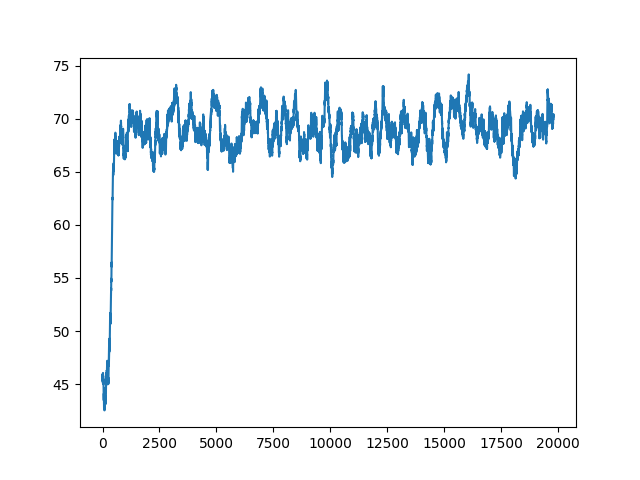
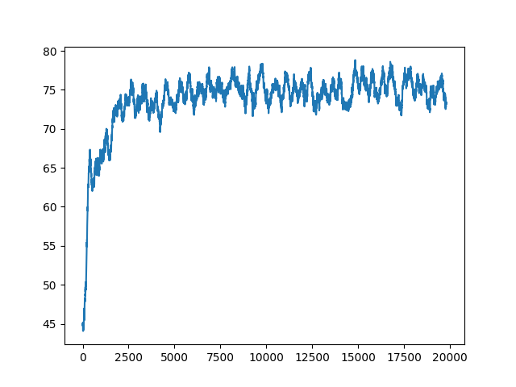

# rl-multi-context-bandit

**Problem Statement**

Let’s say you’re at a casino, and in front of you are 10 slot machines with a flashy
sign that says “Play for free! Max payout is $10!” Wow, not bad! Intrigued, you ask one
of the employees what’s going on, because it seems too good to be true, and she says,
“It’s really true, play as much as you want, it’s free. Each slot machine is guaranteed to
give you a reward between $0 and $10. Oh, by the way, keep this to yourself, but those
10 slot machines each have a different average payout, so try to figure out which one
gives the most rewards on average, and you’ll be making tons of cash!”

What kind of casino is this? Who cares, let’s just figure out how to make the most
money! 

Oh by the way, here’s a joke: What’s another name for a slot machine? A one-
armed bandit! Get it? It has one arm (a lever) and it generally steals your money. We
could call our situation a 10-armed bandit problem, or an n-armed bandit problem
more generally, where n is the number of slot machines. 

Let’s restate our problem more formally. We have n possible actions (here n = 10)
where an action means pulling the arm, or lever, of a particular slot machine, and at
each play (k) of this game we can choose a single lever to pull. 

After taking an action (a) we will receive a reward, Rk (reward at play k). 
Each lever has a unique probability distribution of payouts (rewards). 

For example, if we have 10 slot machines and play
many games, slot machine #3 may give out an average reward of $9 whereas slot
machine #1 only gives out an average reward of $4. Of course, since the reward at
each play is probabilistic, it is possible that lever #1 will by chance give us a reward of
$9 on a single play. But if we play many games, we expect on average that slot machine #1 will 
be associated with a lower reward than #3.

Our strategy should be to play a few times, choosing different levers and observing
our rewards for each action. Then we want to only choose the lever with the largest
observed average reward. Thus, we need a concept of expected reward for taking an
action (a) based on our previous plays. We’ll call this expected reward Qk(a) 
mathematically: you give the function an action (given we’re at play k), and it returns the
expected reward for taking that action. 

**Solution**

Neural network model is used to model the value function.

```
state -> onehot -> model -> y_pred -> softmax ->  action_probabilities -> action -> reward

target = action_probabilities
target[action] = reward

optimize(loss(y_pred, target))
```

## How to run?

```
python context_bandits_with_pytorch.py \
--num_actions=10 \
--num_hidden_neurons=100 \
--num_states=10 \
--max_score=100 \
--epochs=20000
```



```
python context_bandits_with_pytorch.py \
--num_actions=100 \
--num_hidden_neurons=1000 \
--num_states=100 \
--max_score=100 \
--epochs=50000
```

